<table>
<tr>
<td valign="top">    
</td>
<td valign="top"></td>
</tr>
</table>

## Ayush Kumar

**Full Stack Developer · MERN · Next.js & Django**

 

<!-- animated contribution graph, refreshed daily by the workflow -->

